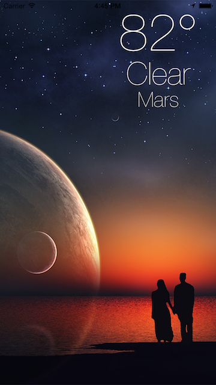
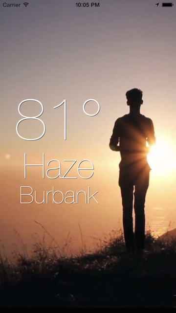

Wethr
===

Wethr provides developers the ability to add location-based current weather conditions to their views as simply as adding any UIView.




Usage
===

WethrView is compatibile with iOS 7/8. If using in an iOS 8 application, you *must make sure you include the NSLocationWhenInUseUsageDescription key and value in your appl's info.plist*, otherwise ***Wethr will not work***.

WethrView is a subclass of `UIView`, so all that you need to do to add it to your view is initialize it with a frame, and add it as a subview. 

```
    WethrView *wethrView = [[WethrView alloc] initWithFrame:CGRectMake(10, 10, 200, 200)];
    [self.view addSubview:wethrView];
```

The temperature, current conditions, and city labels are exposed for any customization, and will automatically resize to handle rotation and to fit whatever frame you create it with.



Wethr current utilizes the OpenWeatherMap API for fetching the weather data. [^1]

[^1]:http://openweathermap.org/


Community
====

Questions, comments, issues, and pull requests welcomed!!


License
====

This project is made available under the MIT license. See LICENSE.txt for details.
